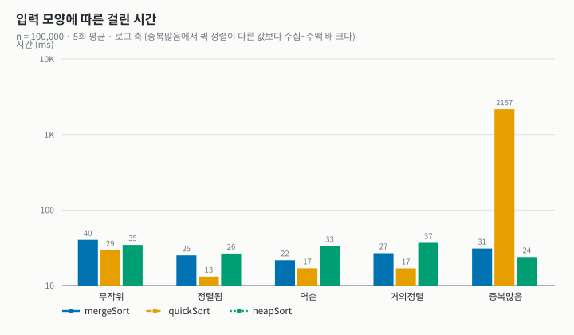
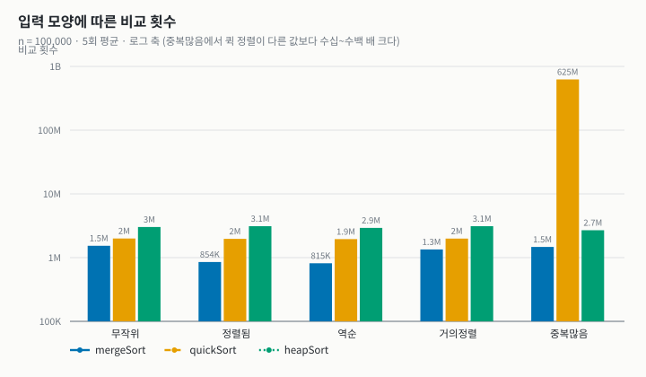
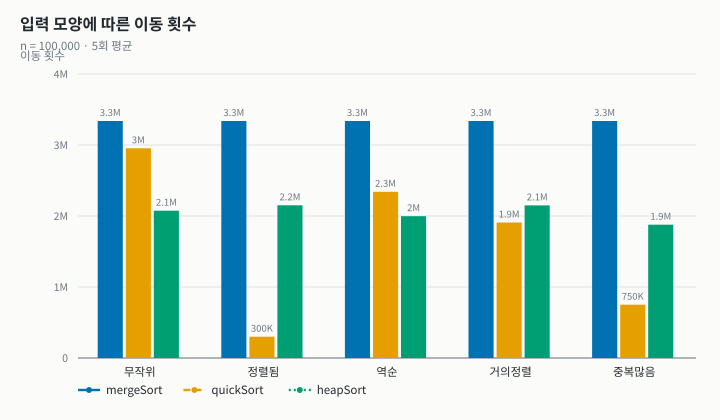
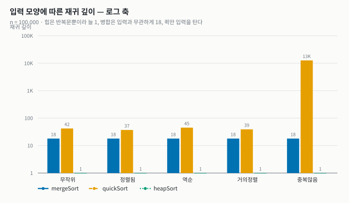
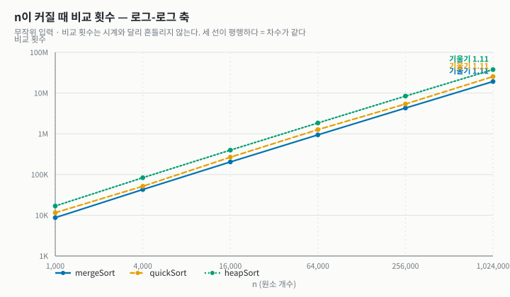
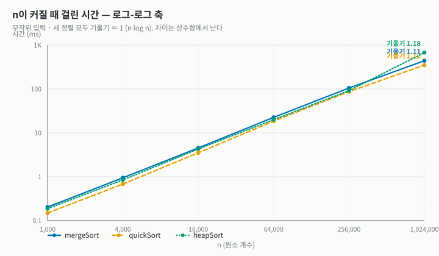
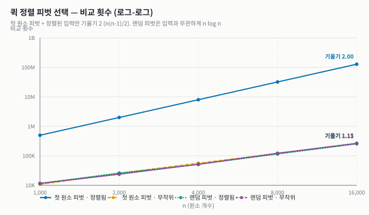
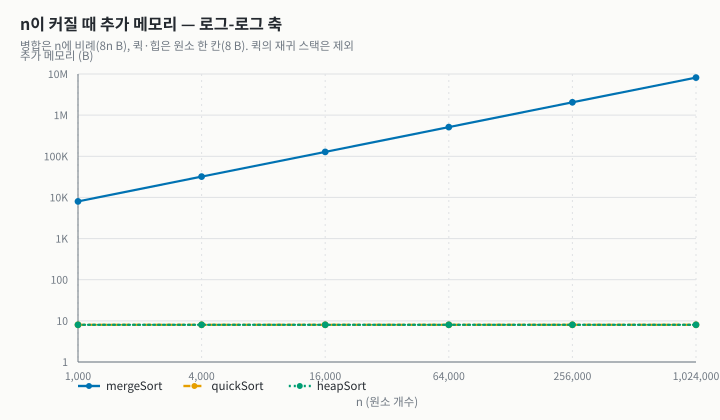

# 정렬 비교 보고서 — 병합 · 퀵 · 힙

| 항목 | 내용 |
| --- | --- |
| 과목 | 2026-2 고급알고리즘 (SIT2001-01) · 과제 1. Compare sorting |
| 이름 / 학번 | 채청민 / 2026193206 |
| GitHub 저장소 | https://github.com/CheongM1n/hw1-compare-sorting |
| 비교한 정렬 | ① 병합 정렬 (배운 정렬) ② 퀵 정렬 (배운 정렬) ③ **힙 정렬 (배우지 않은 정렬)** |
| 실행 · 환경 | `make run` (비교 표) · `make test` (유닛 테스트 50개) · 컨테이너 안 `gcc -std=c17 -Wall -Wextra -O2` |

세 가지 정렬을 **하나의 공통 인터페이스**로 묶고, 같은 잣대로 속도 · 메모리 · 안정성을 쟀다.
세 정렬은 모두 평균 `O(n log n)`이다. 복잡도 등급이 같은 셋을 일부러 골랐다. 등급이 다른 정렬(`O(n^2)` 대
`O(n log n)`)의 비교는 결과가 뻔하지만, 같은 등급 안의 차이는 **상수 계수 · 메모리 · 안정성 · 입력 모양에 대한
반응**에서 나온다. 이 보고서는 그 차이를 잰다.

**차례**: 1. 코드 보고서 — 2. 알고리즘 상세 — 3. 알고리즘 실험 — 4. 결론

---

## 1. 코드 보고서

### 1.1 세 정렬을 고른 이유

| 정렬 | 평균 | 최악 | 추가 메모리 | 안정성 | 일하는 자리 |
| --- | --- | --- | --- | --- | --- |
| 병합 | `O(n log n)` | `O(n log n)` | `O(n)` | 안정 | 결합 (merge) |
| 퀵 | `O(n log n)` | `O(n^2)` | `O(log n)` 스택 | 불안정 | 나누기 (partition) |
| 힙 | `O(n log n)` | `O(n log n)` | `O(1)` | 불안정 | 자료구조 (sift-down) |

세 정렬은 표의 네 열에서 **서로 한 가지씩 다르다.** 병합만 안정적이고, 퀵만 최악이 `O(n^2)`이며, 힙만 추가
메모리가 `O(1)`이다. 무엇을 내주고 무엇을 얻는지가 정렬마다 달라서, 같은 잣대로 쟀을 때 차이가 드러난다.
또 안정 정렬(병합)과 불안정 정렬(퀵 · 힙)이 섞여 있어 **안정성 실측 열이 실제로 갈린다.**

### 1.2 인터페이스와 파일 구조

부르는 쪽이 정렬 이름을 한 번도 적지 않게 했다. C에는 `interface`가 없으므로 **함수 포인터를 담은 구조체**를
쓰고, 구현을 표 하나에 모았다. `main.c` · 측정 도구 · 테스트는 이 표만 훑는다.

```c
typedef struct SortAlgorithm {
    const char *name, *timeComplexity, *worstComplexity, *spaceComplexity;
    int stable;   /* 안정 정렬이라고 "주장"하는 값 — 테스트가 실측과 대조한다 */
    void (*sort)(void *base, size_t n, size_t size, SortCompare cmp, SortStats *stats);
} SortAlgorithm;

const SortAlgorithm SORT_ALGORITHMS[] = {
    {"mergeSort", "O(n log n)", "O(n log n)", "O(n)",     1, mergeSort},
    {"quickSort", "O(n log n)", "O(n^2)",     "O(log n)", 0, quickSort},
    {"heapSort",  "O(n log n)", "O(n log n)", "O(1)",     0, heapSort},
};
```

| 파일 | 맡은 것 |
| --- | --- |
| `sort.h` | 바깥에 보이는 인터페이스 (`SortAlgorithm`, `SortStats`, `SortCompare`) |
| `sortctx.h` · `sort.c` | 구현끼리만 쓰는 도구 (비교 · 이동을 세는 `sortCompare` · `sortMove` · `sortSwap`) + 구현 표 |
| `mergeSort.c` · `quickSort.c` · `heapSort.c` | 알고리즘 하나씩 |
| `bench.c` | 입력 생성, 시간 · 안정성 측정 (정렬은 자기가 측정당하는 줄 모른다) |
| `main.c` | 비교 표 출력. `--csv`는 같은 측정을 CSV로, `--pivot`은 퀵 정렬 피벗 실험 |
| `tools/plot.py` · `tools/svgchart.py` | 그 CSV로 그래프(SVG)를 그린다. 표준 모듈만 쓴다 |

측정 구조(함수 포인터 인터페이스 · 구현 표 · `(key, tag)` 원소)와 `svgchart.py`는 샘플 저장소
`hw1-sample-2026`의 설계를 가져와 썼다. 정렬 구현 셋, 입력 모양, 피벗 실험, 테스트 추가분은 새로 작성했다.

### 1.3 검증

**유닛 테스트 50개**가 통과한다. 테스트도 구현 표를 훑으므로 세 정렬이 모두 같은 검사를 받는다.

| 검사 | 내용 |
| --- | --- |
| 기본 케이스 | 섞임 · 정렬됨 · 역순 · 중복 · 모두 같은 값 · 원소 1개 · 빈 배열 |
| `qsort` 대조 | 난수 500개를 표준 라이브러리 결과와 맞춰 본다 |
| 크기 훑기 | `n = 0..200` 전부. 분할 · 병합 경계는 2의 거듭제곱이 아닌 크기에서 깨지기 쉽다 |
| 큰 입력 | `n = 100,000`의 다섯 가지 입력 모양이 모두 정렬되는지, 재귀 깊이가 `4 log₂ n` 안인지 |
| 안정성 | `tag` 순서 실측이 구현 표의 `stable` 값과 일치하는지 (병합은 안정, 퀵 · 힙은 불안정이어야 통과) |
| 이론값 | `n = 10` 예제에서 비교 · 이동 수가 이론값과 같은지 (아래 표) |

작은 예제로 **카운터 자체가 맞게 세는지**도 확인했다. 병합의 이동은 입력과 무관하게 "병합에 들어간 원소 수의
합 × 2(temp로 한 번, 제자리로 한 번)"이다. `n = 10`이면 병합된 원소 수의 합이 34이므로 이동은 68회이다.
첫 원소 피벗 퀵에 정렬된 입력을 넣으면 피벗이 매번 최솟값이 되어 비교가 `n(n−1)/2 = 45`회이다.

| 입력 (n = 10) | 병합 비교 / 이동 | 퀵 (첫 원소 피벗) 비교 / 이동 |
| --- | --- | --- |
| `2 8 5 9 1 10 7 6 4 3` | 22 / **68** | 25 / 21 |
| 이미 정렬됨 | 19 / **68** | **45** / 0 |
| 역순 | 15 / **68** | **45** / 15 |

**테스트가 실제로 잡는지도 확인했다(변이 테스트).** 구현을 일부러 망가뜨리고 테스트가 실패하는지 보았다.

| 망가뜨린 곳 | 결과 |
| --- | --- |
| 병합 `merge`의 `<=` → `<` (안정성만 깨짐) | 검사 **3개** 실패 — 결과는 여전히 오름차순이라 안정성 검사가 없었다면 몰랐다 |
| 힙 sift-down에서 큰 자식 대신 작은 자식을 고름 | 검사 **8개** 실패 |
| 힙 heapify에서 루트(0번) sift-down을 빠뜨림 | 검사 **5개** 실패 |
| 퀵 partition의 `<` → `<=` | 실패 **0개** — 같은 값을 반대쪽으로 보낼 뿐 결과는 여전히 옳다(등가 변이). 잡지 못하는 것이 맞다 |

이와 별도로 **ASan · UBSan**을 붙여 테스트를 돌려 경고 0건을 확인했다. 원소 타입을 모르고 바이트 단위
포인터 산술을 쓰므로 필요한 확인이다.

```sh
gcc -std=c17 -Wall -Wextra -g -O1 -fsanitize=address,undefined -Isrc -o asan.out \
    tests/test_sort.c src/sort.c src/mergeSort.c src/quickSort.c src/heapSort.c src/bench.c
```

---

## 2. 알고리즘 상세

### 2.1 병합 정렬 (배운 정렬)

위치로 반씩 나눠 각각 정렬한 뒤, 정렬된 두 절반을 temp를 거쳐 합친다. 나누기는 인덱스 계산뿐이고 **결합에서
일한다.** 레벨마다 병합되는 원소의 합이 `n`, 레벨 수가 `log₂ n`이므로 최선 · 평균 · 최악이 모두 `O(n log n)`이다.

```c
while (i <= mid && j <= hi) {
    if (sortCompareAt(c, i, j) <= 0) {        /* '<=' : 같은 값이면 왼쪽이 먼저 → 안정 */
        sortMove(c, temp + k++ * s, sortElemAt(c, i++));
    } else {
        sortMove(c, temp + k++ * s, sortElemAt(c, j++));
    }
}
/* 한쪽이 바닥나면 남은 쪽은 비교 없이 부어 넣고, temp에서 제자리로 되돌린다. */
```

핵심은 `<=` 한 글자다. `<`로 바꿔도 정렬은 되지만 안정성이 깨진다(1.3의 변이 테스트). 이 구현은 정렬된 입력을
따로 알아보지 않으므로 **이동 횟수가 입력과 무관하게 일정하다** — 3장의 결과표에서 다섯 입력 모두 `3,337,856`이다.

### 2.2 퀵 정렬 (배운 정렬)

피벗을 제자리에 놓고 양쪽을 각각 정렬한다. **나누기에서 일하고 결합은 할 일이 없다** — 병합과 정반대이다.
파티션은 `a[lo]`를 피벗으로 삼아 피벗보다 작은 것을 왼쪽으로 모은 뒤 피벗을 경계에 놓는다(Lomuto 방식).

```c
size_t i = lo;
for (size_t j = lo + 1; j <= hi; j++) {
    if (sortCompareAt(c, j, lo) < 0) {        /* a[j] < pivot 이면 왼쪽 구역으로 */
        i++;
        if (i != j) sortSwap(c, i, j);
    }
}
if (i != lo) sortSwap(c, lo, i);               /* 피벗의 자리 확정 */
```

첫 원소를 그대로 피벗으로 쓰면 **이미 정렬된 입력이 최악**이다. 피벗이 매번 최솟값이라 왼쪽이 늘 비고, 재귀가
외길이 되어 `O(n^2)`이 된다. 그래서 파티션 직전에 구간 안의 **무작위 위치를 골라 `a[lo]`와 바꾸는 랜덤
피벗**을 썼다. 이렇게 하면 최악이 "특정 입력"이 아니라 "입력과 난수의 불운한 조합"이 되어, 어떤 입력에도 기대
`O(n log n)`이다. 난수는 minstd 생성기(`state = state × 16807 mod (2³¹ − 1)`)를 직접 구현했고, 시드를 고정해
**같은 입력이면 늘 같은 결과**가 나온다. `quickSortRandomPivot = 0`으로 두면 첫 원소 피벗으로 돌아가며,
3.2의 피벗 실험이 두 버전을 비교한다.

### 2.3 힙 정렬 (배우지 않은 정렬) — AI를 통해 학습한 내용

힙 정렬은 배우지 않은 정렬이므로 AI(Anthropic Claude)에게 질문하며 학습했다. 위키피디아
*Sorting algorithm — Comparison of algorithms* 표에서 heapsort는 최선 · 평균 · 최악 모두 `n log n`, 메모리 `1`,
불안정으로 분류된다. 이 표의 성질을 실제로 확인하는 것을 목표로 삼았다.

**Q1. 힙이란 무엇인가.** 완전 이진 트리이면서 **모든 부모가 자식 이상인**(최대 힙) 자료구조이다. 루트가 항상
최댓값이다. 완전 이진 트리라서 포인터 없이 배열에 빈칸 없이 담긴다. 0번부터 쓰면 `i`의 자식은 `2i+1`, `2i+2`이다.

**Q2. 힙으로 어떻게 정렬하는가.** 두 단계로 진행한다.

1. **heapify** — 마지막 내부 노드(`n/2−1`)부터 루트까지 거꾸로 각 노드를 **sift-down**한다(자식 중 큰 쪽과
   비교하며 제자리까지 내려보낸다). 끝나면 배열 전체가 최대 힙이다.
2. **추출** — 루트(최댓값)를 힙의 마지막 칸과 바꾸고, 힙 크기를 1 줄인 뒤 새 루트를 sift-down한다. `n−1`번
   반복하면 뒤에서부터 큰 값이 쌓여 오름차순이 된다.

예) `[4, 10, 3, 5, 1]` → heapify → `[10, 5, 3, 4, 1]` → 10을 끝으로 → `[1, 5, 3, 4 | 10]` → sift-down →
`[5, 4, 3, 1 | 10]` → … → `[1, 3, 4, 5, 10]`

선택 정렬과 비교하면 이해가 쉽다. 둘 다 "가장 큰 값을 골라 끝에 놓기"를 반복한다. 선택 정렬은 고를 때마다
`O(n)`을 훑지만, 힙 정렬은 힙 덕분에 `O(log n)`만에 다음 최댓값을 준비한다. **선택 정렬의 "고르기"를 자료구조로
빠르게 만든 정렬**이다.

**Q3. 왜 항상 `O(n log n)`인가.** 트리 높이가 `⌊log₂ n⌋`이라 sift-down 한 번이 `O(log n)`이고, 추출이
`n−1`번이다. 피벗 같은 운이 개입하지 않아 **최악도 `O(n log n)`이 보장된다.** 또 heapify 단계는 `O(n)`이다.
대부분의 노드가 잎 근처라 조금만 내려가면 되기 때문이다. 높이 `h`인 노드는 약 `n/2^(h+1)`개이므로
`Σ h · n/2^(h+1) = O(n)`이다.

**Q4. 장점과 단점은.** 장점은 추가 메모리 `O(1)`이면서 최악 `O(n log n)`이라는 **두 가지를 함께** 갖춘다는 것이다. 병합(메모리 `O(n)`)과
퀵(최악 `O(n^2)`)의 약점을 둘 다 피한다. 단점은 세 가지이다. ① 루트와 끝을 맞바꾸며 같은 값의 순서가 섞여
**불안정**하다. ② 부모와 자식이 `i → 2i`로 멀어져 메모리 접근이 흩어지므로 **캐시 효율이 나쁘다.**
③ 이미 정렬된 입력에서도 이득이 없다(적응적이지 않다).

**Q5. 어디에 쓰이나.** C++ `std::sort`가 쓰는 **인트로 정렬**(introsort)이 대표적이다. 평소엔 퀵 정렬로 돌다가
재귀가 `2 log₂ n`보다 깊어지면 힙 정렬로 바꿔 최악 `O(n log n)`을 보장한다. 힙 자체는 우선순위 큐 · 다익스트라 ·
상위 k개 뽑기에 쓰인다.

학습한 내용을 바탕으로 구현하면서 **sift-down을 교환 대신 "구멍 내리기"로 짰다.** 내려보낼 원소를 `tmp`에 들고
큰 자식을 한 칸씩 끌어올린 뒤, 마지막 구멍에 한 번만 써 넣는다. 레벨당 이동이 3회(교환)에서 1회로 준다.

```c
sortMove(c, c->tmp, sortElemAt(c, root));                 /* 내려보낼 값을 들어낸다 */
for (;;) {
    size_t child = 2 * hole + 1;
    if (child >= n) break;
    if (child + 1 < n && sortCompareAt(c, child, child + 1) < 0) child++;  /* 큰 자식 */
    if (sortCompare(c, sortElemAt(c, child), c->tmp) <= 0) break;           /* 제자리 */
    sortMove(c, sortElemAt(c, hole), sortElemAt(c, child));                 /* 끌어올림 */
    hole = child;
}
sortMove(c, sortElemAt(c, hole), c->tmp);                 /* 구멍에 한 번만 써 넣는다 */
```

레벨마다 비교가 두 번(두 자식끼리, 큰 자식과 `tmp`)이라는 점이 3장에서 **힙의 비교 횟수가 셋 중 가장 많은**
이유가 된다.

---

## 3. 알고리즘 실험

### 3.1 실험 개요

| 재는 것 | 방법 | 주의 |
| --- | --- | --- |
| 시간 | `clock_gettime(CLOCK_MONOTONIC)`, 입력 복사를 뺀 구간, 반복 평균 | 기계 · 부하에 흔들린다. 같은 표 안에서만 견줄 것 |
| 비교 · 이동 | 구현이 `SortStats`에 센다 (교환 1회 = 이동 3회) | 입력이 고정이라 **언제 돌려도 같다.** 해석은 이쪽을 앞세운다 |
| 추가 메모리 | `extraBytes` — 입력 배열 밖에 잡은 최대 바이트 | 재귀 스택은 여기 안 들어간다 → 재귀 깊이로 따로 본다 |
| 재귀 깊이 | `maxDepth` — 실제로 들어간 최대 깊이 | 스택 사용량의 대리 지표 |
| 안정성 | 원소를 `(key, tag)`로 만들고, 정렬 뒤 같은 `key`끼리 `tag`가 오름차순인지 | 구현 표의 `stable`은 주장일 뿐, 이쪽이 실측 |

입력은 다섯 모양이다: **무작위 · 정렬됨 · 역순 · 거의정렬**(정렬된 배열에서 1% 자리만 맞바꿈) · **중복많음**(key 8종).
시드를 고정해(20260930) 세 정렬이 완전히 같은 입력을 정렬한다. 아래 표와 그래프는 **한 번의 같은 실행**에서
나왔고, 측정값은 `report/results.csv` · `report/pivot.csv`에 남겼다.

### 3.2 실험 결과

#### 입력 모양별 (n = 100,000, 5회 평균)

| 입력 | 알고리즘 | 시간(ms) | 비교 | 이동 | 재귀깊이 | 안정(실측) |
| --- | --- | ---: | ---: | ---: | ---: | :---: |
| 무작위 | mergeSort | 40.31 | **1,536,522** | 3,337,856 | 18 | 안정 |
| 무작위 | **quickSort** | **29.38** | 1,995,576 | 2,952,912 | 42 | 불안정 |
| 무작위 | heapSort | 34.52 | 3,019,411 | **2,075,059** | 1 | 불안정 |
| 정렬됨 | mergeSort | 25.07 | 853,904 | 3,337,856 | 18 | — |
| 정렬됨 | **quickSort** | **13.13** | 1,967,664 | 300,366 | 37 | — |
| 정렬됨 | heapSort | 26.49 | 3,112,517 | 2,150,850 | 1 | — |
| 역순 | mergeSort | 21.63 | 815,024 | 3,337,856 | 18 | — |
| 역순 | **quickSort** | **16.92** | 1,948,244 | 2,341,506 | 45 | — |
| 역순 | heapSort | 33.43 | 2,926,640 | 1,997,430 | 1 | — |
| 거의정렬 | mergeSort | 26.77 | 1,344,288 | 3,337,856 | 18 | — |
| 거의정렬 | **quickSort** | **16.88** | 1,986,906 | 1,908,471 | 39 | — |
| 거의정렬 | heapSort | 36.70 | 3,110,796 | 2,148,967 | 1 | — |
| 중복많음 | mergeSort | 30.92 | 1,469,621 | 3,337,856 | 18 | 안정 |
| 중복많음 | quickSort | **2,157.00** | **625,315,994** | 750,192 | **12,661** | 불안정 |
| 중복많음 | **heapSort** | **23.84** | 2,692,054 | 1,877,843 | 1 | 불안정 |

정렬됨 · 역순 · 거의정렬은 key가 모두 달라 안정성이 드러나지 않으므로 `—`로 두었다.



- **중복많음의 퀵 정렬만 혼자 두 자릿수 위에 있다.** 2,157ms로 병합의 약 70배이다. 선형 축에서는 나머지 막대가
  바닥에 붙어 읽히지 않아 로그 축으로 그렸다. 원인은 아래 비교 그래프와 3.3에서 본다.
- 그 한 칸을 빼면 **퀵이 모든 입력에서 가장 빠르다.** 정렬됨 · 거의정렬에서는 무작위보다 1.7~2.2배 빠르다.
- 힙은 입력과 무관하게 24~37ms로 **거의 같은 높이**이다. 입력 모양을 타지 않는다.



- 무작위 입력에서 비교는 **병합 < 퀵 < 힙**(1.5M < 2.0M < 3.0M)이다. 그런데 시간은 퀵이 가장 빠르다.
  **비교가 적다고 빠른 것이 아니다.**
- 병합은 역순(815,024)이 정렬됨(853,904)보다 비교가 적다. 역순에서는 오른쪽 절반이 통째로 먼저 나가서 한쪽이
  일찍 바닥나고, 남은 쪽은 비교 없이 부어지기 때문이다.
- 중복많음의 퀵은 6억 2천만 회로 다른 칸보다 **200배 이상** 많다.



- **병합은 다섯 입력 모두 `3,337,856`회로 한 치도 다르지 않다.** 모든 병합이 구간 전체를 temp로 보냈다
  되돌리기 때문이다(2.1).
- 퀵은 정렬됨에서 이동이 30만 회로 가장 적다. 랜덤 피벗 뒤에도 이미 제자리인 원소가 많아 교환할 일이 적다.
- 힙은 "구멍 내리기" 덕에 교환 대신 한 칸씩 끌어올려, 비교는 가장 많아도 **무작위 입력의 이동은 가장 적다.**



- 힙은 반복문뿐이라 **어떤 입력에서도 1**이다. 병합은 입력과 무관하게 `⌈log₂ n⌉ + 1 = 18`이다.
- **퀵만 입력을 탄다.** 평소 37~45(≈ 2.5 log₂ n)인데, 중복많음에서 12,661까지 치솟는다. 이 열이 3.3의 단서이다.

#### n을 키우며 (무작위)

| n | merge 비교 | 배수 | quick 비교 | 배수 | heap 비교 | 배수 | n log n 배수 |
| ---: | ---: | ---: | ---: | ---: | ---: | ---: | ---: |
| 1,000 | 8,742 | — | 11,529 | — | 16,865 | — | — |
| 4,000 | 42,867 | ×4.90 | 51,565 | ×4.47 | 83,399 | ×4.95 | ×4.80 |
| 16,000 | 203,320 | ×4.74 | 266,623 | ×5.17 | 397,512 | ×4.77 | ×4.67 |
| 64,000 | 941,151 | ×4.63 | 1,266,943 | ×4.75 | 1,846,185 | ×4.64 | ×4.57 |
| 256,000 | 4,276,555 | ×4.54 | 5,386,403 | ×4.25 | 8,410,504 | ×4.56 | ×4.50 |
| 1,024,000 | 19,154,395 | ×4.48 | 25,361,006 | ×4.71 | 37,737,649 | ×4.49 | ×4.45 |

`n`이 4배가 될 때 `O(n^2)`이면 비교가 ×16, `O(n)`이면 ×4가 된다. 세 정렬 모두 **×4.5 안팎으로 `n log n`의
배수(마지막 열)를 그대로 따라간다.** 퀵만 ×4.25~×5.17로 출렁이는데, 피벗이 난수라 분할이 매번 조금씩 다르기 때문이다.



- 로그-로그에서는 기울기가 곧 복잡도 지수다. 셋 다 **1.11**이다. 같은 구간에서 `n log n` 자체의 기울기가 1.10이니,
  셋 다 `n log n`과 구별되지 않는다.
- 세 선이 **평행**하다. 차수가 같고 **상수만 다르다**는 뜻이다. `n log₂ n`으로 나누면 병합 ≈ 0.93, 퀵 ≈ 1.2,
  힙 ≈ 1.8이다. 비교 정렬이 최악에 해야 하는 최소 비교 수 `log₂(n!) ≈ n log₂ n − 1.44n`에 병합이 가장 가깝다.

| n | merge(ms) | quick(ms) | heap(ms) |
| ---: | ---: | ---: | ---: |
| 1,000 | 0.204 | 0.149 | 0.188 |
| 4,000 | 0.951 | 0.681 | 0.850 |
| 16,000 | 4.54 | 3.51 | 4.30 |
| 64,000 | 22.63 | 18.62 | 20.02 |
| 256,000 | 105.36 | 87.07 | 91.74 |
| 1,024,000 | 440.49 | **350.14** | 675.47 |



- 시간 기울기는 병합 1.12, 퀵 1.13, **힙 1.16**이다. 비교 횟수의 기울기는 셋 다 1.11로 같았으므로, 힙만 **연산 수보다
  시간이 더 빨리 자란다.**
- `n = 256,000`까지 힙은 병합보다 빠르거나 비슷하다. 그런데 `n = 1,024,000`에서는 병합의 1.5배, 퀵의 1.9배가 걸린다.
  비교 횟수의 비율(힙/병합 ≈ 1.97)은 `n`과 무관하게 일정한데 시간 격차만 벌어진다. 원인은 연산 수가 아니라
  **메모리 접근 패턴**으로 보인다. sift-down은 `i → 2i+1`로 점점 멀리 떨어진 칸을 읽어, 배열(8 B × n = 8 MB)이
  캐시보다 커지면 캐시 미스가 늘어난다. 2.3 Q4-②에서 학습한 단점이 실측으로 나타난 것이다.

#### 퀵 정렬의 피벗 — 첫 원소 vs 랜덤 (`./src/main.out --pivot`)

| n | 첫 원소 · 무작위 | 첫 원소 · 정렬됨 | 랜덤 · 무작위 | 랜덤 · 정렬됨 | n(n−1)/2 |
| ---: | ---: | ---: | ---: | ---: | ---: |
| 1,000 | 10,690 | **499,500** | 11,529 | 11,672 | 499,500 |
| 4,000 | 56,172 | **7,998,000** | 51,565 | 51,021 | 7,998,000 |
| 16,000 | 260,321 | **127,992,000** | 266,623 | 255,240 | 127,992,000 |

표의 값은 비교 횟수이다.



- 첫 원소 피벗에 정렬된 입력을 넣으면 비교가 정확히 **`n(n−1)/2`회**이고 기울기는 **2.00**이다. `n = 16,000`에서
  391.5ms, 재귀 깊이 16,000(= n)이다. 재귀가 외길이 된다.
- 같은 입력에 랜덤 피벗을 쓰면 비교가 255,240회로 **약 500배 줄고**(1.65ms, 깊이 31), 기울기가 1.1대로 돌아온다.
- 무작위 입력에서는 두 피벗의 차이가 없다. 입력이 이미 무작위이면 첫 원소도 무작위 피벗이기 때문이다.
  **랜덤 피벗은 입력의 순서가 무엇이든 무작위 입력을 받은 것처럼 만든다.**

#### 메모리와 안정성

| 알고리즘 | 추가 메모리 (n = 1,024,000) | 재귀 깊이 | 안정성 (실측) |
| --- | ---: | ---: | :---: |
| mergeSort | 8,192,008 B (≈ 8 MB) | 21 | 안정 |
| quickSort | 8 B + 재귀 스택 | 51 (중복많음 n=100,000에서 12,661) | 불안정 |
| heapSort | 8 B | 1 | 불안정 |



- 병합만 `n`에 비례해 자란다(8n 바이트). 퀵 · 힙은 원소 한 칸(8 B)으로 선이 바닥에 평평하다.
- 다만 퀵의 `O(log n)`은 재귀 스택이라 `extraBytes`에 잡히지 않는다. **스택은 재귀 깊이 열로 보아야 한다.**
  평소 51이면 무시할 만하지만, 12,661이면 `n`이 더 클 때 스택 오버플로의 위험이 있다.
- 병합은 모든 입력에서 안정, 퀵 · 힙은 중복이 있는 입력에서 **실제로 순서가 뒤집혔다.** 구현 표의 주장과 실측이 일치한다.

### 3.3 분석

**① 같은 `O(n log n)`, 다른 상수.** 비교 횟수의 기울기가 셋 다 1.11로 같고, 차이는 상수(0.93 : 1.2 : 1.8)에 있다.
그 상수조차 시간 순위를 정하지 못한다. 비교가 가장 많은 쪽도 적은 쪽도 아닌 퀵이 가장 빠르다. 퀵은 병합보다 비교를
30% 더 하지만 temp가 없어 이동이 12% 적고, 파티션이 배열을 앞에서부터 순차적으로 훑어 캐시에 유리하다. 반대로
힙은 이동이 가장 적은데도 큰 `n`에서 가장 느리다. **시간은 연산 수 × 메모리 접근 비용**이고, 후자는 복잡도 표에
드러나지 않는다.

**② 랜덤 피벗이 막지 못하는 입력 — 중복.** 중복많음(key 8종)에서 퀵의 비교가 6억 2천만 회, 재귀가 12,661단까지
갔다. 원인은 파티션 조건 `a[j] < pivot`이다. 피벗과 **같은 값은 모두 오른쪽**으로 가므로, 같은 key가 약 12,500개씩
모인 구간에서는 매번 원소가 하나씩만 줄어든다. 정렬된 입력을 첫 원소 피벗으로 돌린 것과 같은 외길이 된다. 피벗을
아무리 잘 골라도 **같은 값끼리는 나눌 수 없다.** 랜덤 피벗은 "순서"에 대한 해법이지 "중복"에 대한 해법이 아니다.
해법은 파티션 쪽에 있다. 피벗과 같은 값을 가운데에 따로 모으는 **3-way 분할**을 쓰거나, 같은 값에서 양쪽 포인터가
모두 멈추는 **Hoare 분할**을 쓰면 된다. 같은 입력에서 병합(30.9ms)과 힙(23.8ms)은 전혀 영향을 받지 않았다.
**최악을 보장하는 정렬의 가치**가 여기서 드러난다.

**③ 입력 모양에 대한 반응.** 병합은 이동이 고정이고 비교만 입력을 탄다. 퀵은 이동이 입력을 크게 탄다(정렬됨 30만,
무작위 295만). 힙은 비교 · 이동 · 시간이 모두 입력과 거의 무관하다. 먼저 힙을 만들면서 원래 순서를 흩어 버리기
때문이다. 적응성이 없다는 단점이지만, **어떤 입력이 와도 예측할 수 있다**는 장점도 된다.

### 3.4 한계

- **시간은 기계 하나(공용 클라우드 컨테이너)에서 잰 값이다.** 반복 평균을 냈지만 실행마다 수~수십 % 흔들린다.
  그래서 해석은 재현되는 비교 · 이동 횟수를 앞세웠다.
- **힙이 느려지는 원인을 캐시로 본 것은 추론이다.** 비교 횟수 비율이 일정한데 시간만 벌어진다는 간접 근거이며,
  캐시 미스를 하드웨어 카운터(`perf`)로 직접 재지는 않았다.
- **퀵의 스택은 `extraBytes`에 들어가지 않는다.** 명시적 스택으로 바꾸면 그 몫까지 바이트로 잴 수 있다.
- **중복 문제의 해법(3-way 분할)은 구현하지 않았다.** 이번 과제는 배운 파티션을 그대로 두고 그 한계를 재는 데 집중했다.
- **입력은 `rand()`로 만든다.** 시드는 고정했지만 분포는 표준 라이브러리에 맡겼다.

---

## 4. 결론

| 기준 | 가장 좋은 정렬 | 근거 (이번 실측) |
| --- | --- | --- |
| 평균 속도 | **퀵** | 이동이 적고 temp가 없다. `n = 1,024,000`에서 병합보다 약 1.3배 빠름 |
| 최악 보장 | 병합 · 힙 | 퀵은 첫 원소 피벗 + 정렬됨, 그리고 중복많음에서 `O(n^2)` |
| 메모리 | **힙** | `O(1)`, 재귀도 없다. 병합은 `O(n)`, 퀵은 재귀 스택 |
| 안정성 | **병합** | 퀵 · 힙은 불안정 (실측 확인) |
| 비교 효율 | **병합** | 비교 ≈ 0.93 n log₂ n, 이론적 최솟값에 가장 가깝다 |
| 예측 가능성 | **힙** | 어떤 입력이든 비교 · 시간이 거의 같다 |

같은 `O(n log n)`이어도 "가장 좋은 정렬"은 없다. **속도가 중요하면 퀵, 안정성이 필요하면 병합, 메모리가 부족하고
최악을 보장해야 하면 힙**이다. 실제 라이브러리는 이 셋을 섞어 쓴다. C++ `std::sort`는 퀵에 힙을 더한 인트로 정렬이고,
Java · Python의 객체 정렬은 병합 기반의 Timsort이다. 이번 실측은 그 선택의 이유를 수치로 보여 준다. 퀵은 빠르지만
최악(외길 재귀)이 있고, 그 최악을 힙이 `O(1)` 메모리로 막아 준다. 안정성이 필요한 곳에는 병합이 간다.

새로 학습한 힙 정렬에서 얻은 것은 두 가지이다. 위키피디아 표의 성질(`n log n` 보장, 메모리 1, 불안정)이 실측으로
모두 확인되었다. 그리고 표에 없는 **캐시 효과** 때문에, 비교 횟수와 달리 큰 `n`에서 가장 느려진다는 것을 알게 되었다.
배운 퀵 정렬에서는 랜덤 피벗이 순서로 인한 최악은 없애지만 **중복으로 인한 최악은 남는다**는 것을 확인했다.

---

**재현 방법**: `make test` (유닛 테스트 50개) · `make run` (비교 표) · `make charts` (다시 재고 그래프 · CSV 재생성) ·
`python3 tools/plot.py --reuse` (측정값은 그대로 두고 그래프만 다시 그림) · `./src/main.out --pivot` (피벗 실험)
